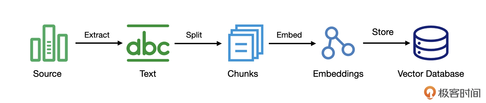

# RAG 的其他知识
## 向量和向量数据库
许多 AI 算法处理的都不是文字，而是向量。采用向量的方案，“语义”的匹配程度就转换成了向量之间的相似程度。  
计算向量相似度的算法有很多，比如，余弦相似度、内积、欧氏距离等等。

有了向量，当用户提出问题时，处理过程就变成了将问题转换为向量，然后计算向量之间的距离，找到与问题向量最接近的文档向量，从而实现“语义”的匹配。

### 怎样将文本转换成向量

在开源社区里，已经有很多人提供了这样的模型，我们需要做的就是把模型部署起来，然后，调用这个模型。当然，也有人把已经训练好的模型部署成一个服务，这样，我们就可以直接调用现成的服务。

OpenAI 就提供了一个专门负责将文本转换成向量的 API——Embeddings。我们可以根据需要，选择自己部署模型，或是选择别人提供的服务。不同的 Embedding 模型之间的差异主要取决于训练样本，比如有的模型会在中文处理上表现得比较好。

### 向量数据库
我们需要的既不是 Oracle、MySQL 这样的关系数据库，也不是 MongoDB、Redis 这样的 NoSQL 数据库。因为我们后续处理的都是向量，所以，我们需要的是向量数据库。

在大模型兴起之后，随着 RAG 的蓬勃发展，向量数据库一下子站到舞台中央，开始成为许多大模型应用的重要组件。

向量数据库与传统数据库有很大的差别，在使用方式上，传统数据库搜索信息倾向于精确匹配，而向量数据库的匹配则是语义上的接近。

## 索引
上面讲的都是怎样使用数据，也就是检索的过程。其实，还有一个关键的问题没有解决，这些数据从何而来，怎么跑到向量数据库里去的。这就是 RAG 另外一个重要的过程：索引（Indexing）。

下面是一个常见的索引过程：

在这个过程里面，我们会先对信息源做一次信息提取。信息源可能是各种文档，比如 Word 文档、PDF 文件，Web 页面，甚至是一些图片。从这些信息源中，我们把内容提取出来，也就是其中的文本。

接下来，我们会把这些文本进行拆分，将其拆分成更小的文本块。  
之所以要拆分，主要是原始的文本可能会比较大，这并不利于检索，还有一点重要原因是，我们前面说过，要把检索到的信息拼装到提示词里，过大的文本可能会造成提示词超过模型有限的上下文窗口。

再来，就是把文本块转换成向量，也就是得到 Embedding 的过程。前面我们说过，这个过程往往是通过训练好的模型来完成的。到这里，我们就把信息转换成了向量。最后一步，就是把得到的向量存储到向量数据库中，供后续的检索使用。

---

至此，我们对常见的 RAG 流程已经有了基本了解。但实际上，RAG 领域正处于一个快速发展的过程中，有很多相关技术也在不断地涌现：
- 虽然采用向量搜索对于语义理解很有帮助，但一些人名、缩写、特定 ID 之类的信息，却是传统搜索的强项，有人提出混合搜索的概念，将二者结合起来；
- 通过各种搜索方式，我们会得到很多的候选内容，但到底哪个与我们的问题更相关，有人引入了重排序（Rerank）模型，以此决定候选内容与查询问题的相关程度；
- 除了在已有方向的努力，甚至还有人提出了 RAG 的新方向。我们前面讨论的流程前提条件是把原始信息转换成了向量，但这本质上还是基于文本的，更适合回答一些事实性问题。它无法理解更复杂的关系，比如，我的朋友里谁在 AI 领域里工作。所以，有人提出了基于知识图谱的 RAG，知识图谱是一种结构化的语义知识库，特别适合找出信息之间的关联。

由此你可以看到，想要打造一个好的 RAG 应用并不是很容易的一件事，但在一些技术框架支持下，上手编写一个 RAG 应用却不是什么难事。