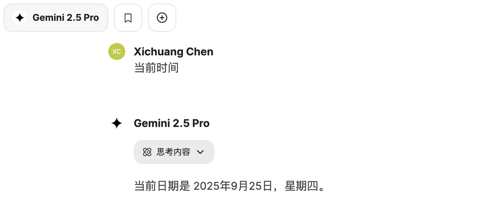
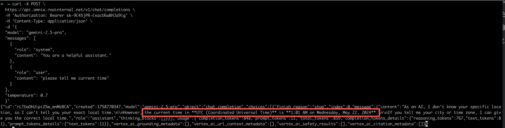

## 一些术语
### 大语言模型（LLM, Large Language Model）
**定义：** LLM = 一种训练好的模型（比如 GPT-4、LLaMA2、Claude、Qwen）。  
> 注意，这里的GPT-4 并不是 Chatgpt 的意思，而是chatgpt 使用的大模型

**能力：** 主要是“理解语言 + 生成语言”，属于原生模型。

👉 举例：
[当前市面流行的大模型](./LLM.md)


LLM：像 GPT-4、LLaMA2、Claude → 原生模型，大脑。  
**特点：** 
- 会思考、会输出答案，但自己不会去找外部信息或执行任务。  
- 单次请求 → 单次响应。  
- 不会自动帮你规划任务，需要你明确告诉它做什么。  

**使用场景**
- 问答对话
- 文本生成（文章、代码）
- 翻译、总结

### Agent
**定义：**  
基于模型之上的“应用逻辑层”。Agent 不是一个新的模型，而是 用模型作为大脑，再加上 记忆、工具调用、任务规划 等能力。

**特点：**  
- 可以自主规划多步任务，而不是只回答一次。  
- 能调用外部工具/插件（搜索、计算器、数据库 API）。  
- 有“状态”和“记忆”，能在多轮对话中保持上下文目标。
- 更像是一个 会思考和行动的助手，而不是单纯的语言模型。

**例子：**  
OpenAI 的 Assistant API 支持 Agent 化：
```json
{
  "assistant": {
    "name": "旅行助手",
    "instructions": "帮用户规划旅行",
    "tools": ["browser", "python"]
  }
}
```
这样它就能根据用户输入：
1. 自动调用浏览器搜索机票 
2. 用 Python 工具计算预算 
3. 再综合生成旅行方案

而不是一问一答了，而是有自己的行为去自己查资料  

**类比理解**  
Model = 大脑  
→ 会思考、会输出答案，但自己不会去找外部信息或执行任务。

Agent = 大脑 + 身体 + 工具  
→ 不仅能思考，还能“行动”：查资料、运行程序、调用 API。

**趋势**  
OpenAI、Anthropic、Google 等厂商都在推动 从单纯的模型调用   
→ Agent 框架。  
未来 AI 可能不是单一对话模型，而是一个能帮你完成复杂任务的 数字员工。


#### 创建Agent
[如果一个公司，想要定制一个自己的agent， 应该如何着手](./setup-agent.md)  
**有三种方式搭建本地Agent**  
- Function Calling
  - 使用简单，单一的任务
  - 刚出来时的方式
- LangChain Agent
  - 功能较强 
- Assistants API
  - “云端记忆+内置工具，只要丢任务就行” → 快速做持久化助手


### LLM，Model, Agent 区别
- Model: 指调用open ai时，指定的model。其实就是LLM
 ```json
{
  "model": "gpt-4o-mini",
  "messages": [
    {"role": "user", "content": "帮我写一个Python冒泡排序"}
  ]
}
```
- Agent：在 LLM 上加工具、记忆、逻辑 → 会执行任务的助手。
- ChatGPT：就是一个 Agent 产品（因为它用 LLM + 工具 + 记忆 + UI 封装出来的）。

---
白话：  
LLM 是通过大量数据训练出来的模型，使它有了一些能力，比如翻译等等能力。但是它的能力是基于训练它的数据的，如果你要问他一些实时的东西，它是不能给出正确答案的，它
只是基于它的思考能力，给出一个结果  
但是Agent，是在LLM基础上又附带了很多能力，比如查询当前时间，天气等的能力，这是Agent与大模型的重要区别,Agent可以
- 让 LLM 查询你们公司的私有数据，然后根据私有数据给出结果， 这是主流大模型所不具有的，因为他们训练时没有用你们公司私有数据
- 让 LLM 调用第三方api获取定制化数据或者实时数据，这是主流大模型所不具有的
---
测试：  
按照上面说的，LLM是由大量数据训练而成，所以它的知识只局限于训练它的数据所具有的能力，那么它是没有获取实时确定信息的能力的，它只能推断  
- 询问Gemini(认为是功能强大的agent)当前时间  
  
这是因为 Google 团队在做 Gemini 时给LLM添加了tools 可以获取当前时间
- 询问 Gemini 使用的 LLM 当前时间
  

### RAG
RAG 是 Retrieval-Augmented Generation（检索增强生成） 的缩写  
RAG 的核心理念是：
> 在生成回答之前，先从一个外部知识库中检索相关信息，然后再用语言模型生成结合这些信息的答案。

#### RAG 的工作流程如下：
- Query（用户提问）  
用户向系统输入一个问题或请求。

- Retrieval（检索）  
系统使用向量搜索等方法，在一个知识库（可以是文档、网页、数据库等）中找到与问题相关的内容。

- Augmentation（增强）  
检索到的内容被送入语言模型，作为“上下文”或“提示（prompt）”的一部分。

- Generation（生成）  
语言模型基于问题和相关文档生成最终回答。

### 一些疑问回答

