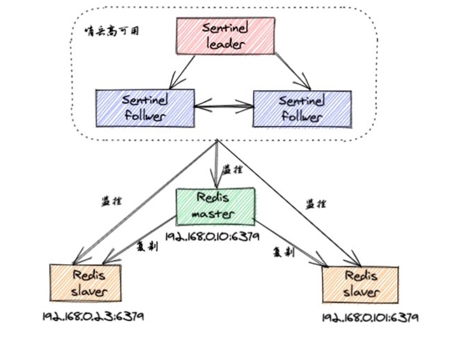
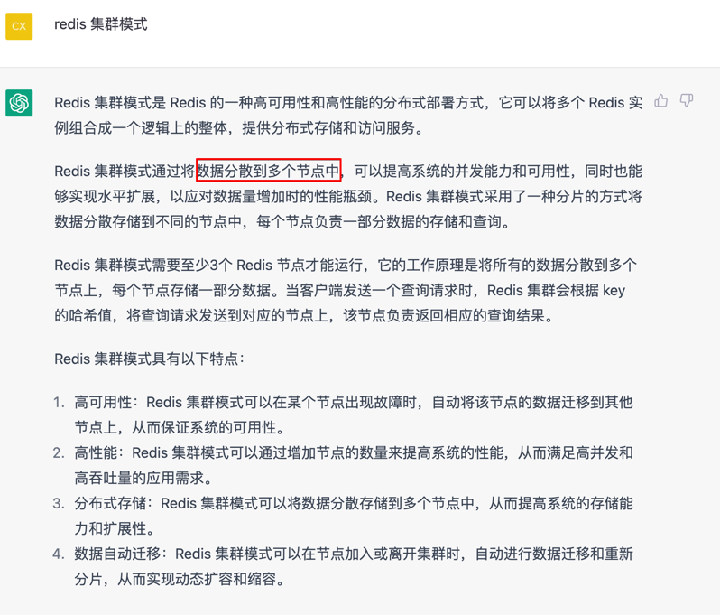

# Redis

## Redis 使用场景
- [mysql + redis 黄金搭配，减少 mysql 服务器压力](https://github.com/xichuang-chen/encyclopaedia/blob/main/doc/Architecture/%E4%BB%8E0%E5%BC%80%E5%A7%8B%E5%AD%A6%E6%9E%B6%E6%9E%84/%E9%AB%98%E6%80%A7%E8%83%BD%E7%BC%93%E5%AD%98%E6%9E%B6%E6%9E%84.md#%E4%BB%80%E4%B9%88%E6%83%85%E5%86%B5%E4%B8%8B%E9%9C%80%E8%A6%81%E4%BD%BF%E7%94%A8%E7%BC%93%E5%AD%98)
## Redis 缓存更新策略
[缓存更新策略](https://github.com/xichuang-chen/encyclopaedia/blob/main/doc/Architecture/%E4%BB%8E0%E5%BC%80%E5%A7%8B%E5%AD%A6%E6%9E%B6%E6%9E%84/%E9%AB%98%E6%80%A7%E8%83%BD%E7%BC%93%E5%AD%98%E6%9E%B6%E6%9E%84.md#%E7%BC%93%E5%AD%98%E7%AD%96%E7%95%A5)

## Redis 缓存过期淘汰策略
如果 key 过期或者 Redis 内存满了，如何删除数据的？  
再将 Redis 缓存过期淘汰策略之前，先说几个常用的淘汰策略
- 立即删除  
  内存友好，CPU 不友好
- 惰性删除  
  内存极不友好，Cpu友好
- 定期删除策略  
上面两种的折中处理

### Redis 缓存过期淘汰策略
  
allkeys-iru 和 allkeys-random 推荐使用

## Redis 持久化
恢复数据优先 AOF, 如果 AOF 没开，再 RDB  

### RDB
RDB持久化产生的文件是一个经过压缩的二进制文件，这个文件可以被保存到硬盘中，可以通过这个文件还原数据库的状态，
它可以手动执行，也可以在redis.conf配置文件中配置，定时执行。  

**原理:**  
父进程依然接受读消息，fork 子进程写 RDB 文件，写完删除老的RDB

**优点：**
- RDB 的内容为二进制的数据，占用内存更小，更紧凑，更适合做为备份文件;
- RDB 对灾难恢复非常有用，它是一个紧凑的文件，可以更快的传输到远程服务器进行 Redis 服务恢复;
- RDB 可以更大程度的提高 Redis 的运行速度，因为每次持久化时 Redis 主进程都会 fork() 一个子进程，进行数据持久化到磁盘，Redis 主进程并不会执行磁盘 I/O 等操作;
- 与 AOF 格式的文件相比，RDB 文件可以更快的重启。
- 
**缺点：**
- 因为 RDB 只能保存某个时间间隔的数据，如果中途 Redis 服务被意外终止了，则会丢失一段时间内的 Redis 数据。
- RDB 需要经常 fork() 才能使用子进程将其持久化在磁盘上。如果数据集很大，fork() 可能很耗时，并且如果数据集很大且 CPU 性能不佳，则可能导致 Redis 停止为客户端服务几毫秒甚至一秒钟。
### AOF
以日志的形式来记录每个写的操作，将Redis执行过的所有指令记录下来(读操作不记录)，只许追加文件但不可以改写文件，redis启动之初会读取该文件重新构建数据，换言之，redis重启的话就根据日志文件的内容将写指令从前到后执行一次以完成数据的恢复工作。

## Redis 集群

### 主从复制模式
主从复制模式中包含一个主数据库实例（master）与一个或多个从数据库实例（slave）  
  

**同步**  
- slave启动后，向master发送SYNC命令，master接收到SYNC命令后通过bgsave保存快照（即上文所介绍的RDB持久化），并使用缓冲区记录保存快照这段时间内执行的写命令
master将保存的快照文件发送给slave，并继续记录执行的写命令
- slave接收到快照文件后，加载快照文件，载入数据                  全量同步
- master快照发送完后开始向slave发送缓冲区的写命令，slave接收命令并执行，完成复制初始化
- 此后master每次执行一个写命令都会同步发送给slave，保持master与slave之间数据的一致性

**优点:**  
- 读写分离，减轻单 redis 压力
- 主从数据同步是非阻塞方式  

**缺点:**  
- 不具备自动容错与恢复功能  
- 不支持扩容

### Sentinel(哨兵)模式
  
哨兵模式基于主从复制模式，只是引入了哨兵来监控与自动处理故障  

- 监控master、slave是否正常运行
- 当master出现故障时，能自动将一个slave转换为master（大哥挂了，选一个小弟上位）
- 多个哨兵可以监控同一个Redis，哨兵之间也会自动监控

**优点:**  
- 哨兵模式基于主从复制模式，所以主从复制模式有的优点，哨兵模式也有  
- 哨兵模式下，master挂掉可以自动进行切换，系统可用性更高

**缺点:**
- 不支持扩容

### Cluster 模式
哨兵模式解决了主从复制不能自动故障转移，达不到高可用的问题，但还是存在难以在线扩容，Redis容量受限于单机配置的问题。
Cluster模式实现了Redis的分布式存储，即每台节点存储不同的内容，来解决在线扩容的问题  

**Cluster采用无中心结构,它的特点如下：**
- 所有的redis节点彼此互联(PING-PONG机制),内部使用二进制协议优化传输速度和带宽
- 节点的fail是通过集群中超过半数的节点检测失效时才生效
- 客户端与redis节点直连,不需要中间代理层.客户端不需要连接集群所有节点,连接集群中任何一个可用节点即可

  
  
  

