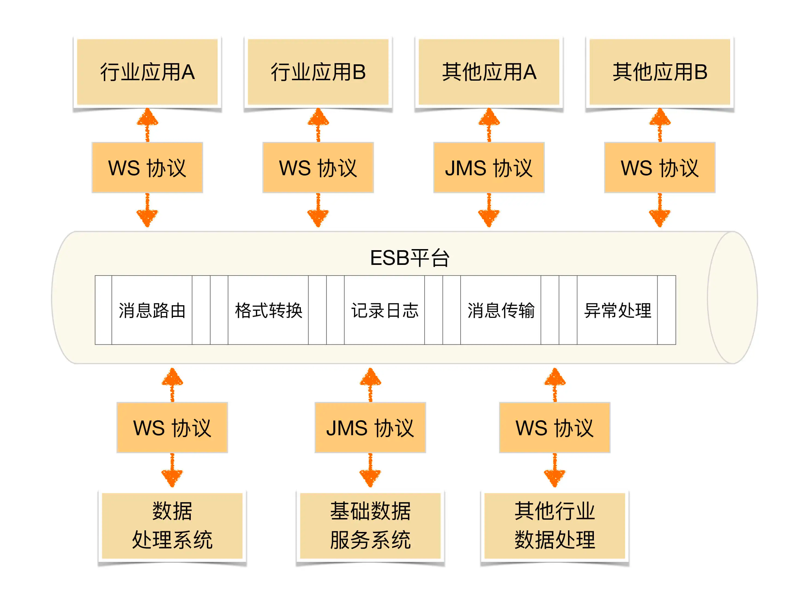

# SOA (Service Oriented Architecture)
自己的理解(被别人诟病不准确，不过这么理解容易):  
就是微服务的思想，SOA 的核心 ESB(Enterprise Service Bus 企业服务总线)  来适配各个服务之间的通信，比如把
AMI 转成 Rest 之类的。  
微服务是规定各服务之间统一使用 rest 接口，另外 ESB 还承担微服务中服务发现的功能  

微服务与SOA的核心区别是什么呢？
> 有人说 SOA 是一种服务解耦思想，微服务是他的实践  
> 主要的区别可能是，在实践上，对于服务大小划分的问题，SOA 划分的粒度是各个系统，古老的系统，来对那些古老
> 的系统做重构，做适配

  

ESB 虽然功能强大，但现实中的协议有很多种，如 JMS、WS、HTTP、RPC 等，数据格式也有很多种，
如 XML、JSON、二进制、HTML 等。ESB 要完成这么多协议和数据格式的互相转换，工作量和复杂度都很大，
而且这种转换是需要耗费大量计算性能的，当 ESB 承载的消息太多时，ESB 本身会成为整个系统的性能瓶颈。
