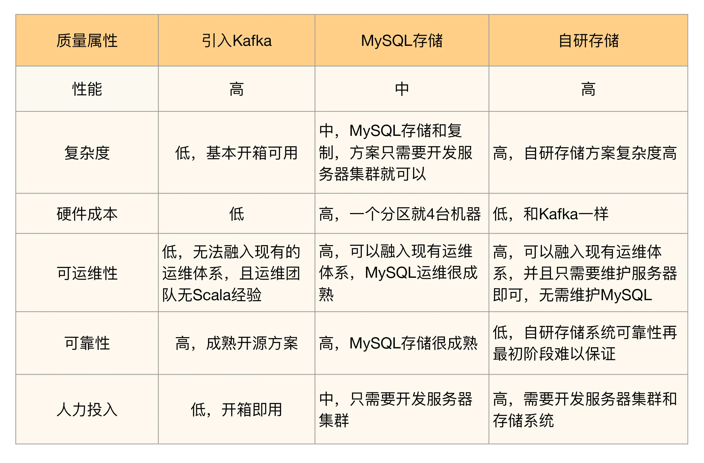

# 架构是什么
*架构(Architecture)和框架(Framework)有和区别*  
*模块与组件又是什么区别*  

架构是顶层设计；框架是面向编程或配置的半成品；组件是从技术维度上的复用；模块是从业务维度上职责的划分；系统是相互协同可运行的实体。  
```markdown
搬砖的：“头，我们要造什么？”；（做什么系统？）

工程师：“龙之梦商城”；（XXX系统，比如微博系统）

搬砖的：“图纸画出来了嘛？”；（架构是怎么设计的？）

工程师：“一楼主要以女性消费为主体、二楼以大众娱乐为主体、三楼以美食为主体”；（相当于微博系统中的各个子系统，比如评论子系统、动态子系统、消息子系统）

搬砖的：“头，说人话”；

工程师：“一楼有卖衣服、化妆品的，二楼有唱歌、看电影的，三楼有吃的”；（【模块】按照逻辑区分，比如存储数据模块、搜索模块、消息推送模块）

搬砖的：“有没有很知名的店啊？”；

工程师：“有的，一楼有香奈儿、优衣库...、二楼有好乐迪、万达影院....、三楼有海底捞、避风塘.....”；（【组件】按照物理区分，存储数据模块对应Mysql、搜索模块对应ElasticSearch、 消息推送模块对应Kafka）

搬砖的：“对了，头，商城大门有啥需要叮嘱的施工规范不？或有啥简化施工工艺的新技术嘛？”；（有框架的可以用吗？）

工程师猛吸了一口烟，把烟头扔在地上，用皮鞋左右撵了两下，缓缓从嘴里崩出四个字。
“老样子吧”。（Spring全家桶甩起来）
```


# 架构设计的真正目的

- ~~系统必须有架构~~ 
- ~~做了架构设计就能提升开发效率~~ 不一定
- ~~公司流程要求系统开发过程中必须有架构设计或者架构师总要做点啥~~

因为流程有规定，所以要做架构设计；因为架构师要做事，所以要做架构设计，这都是很表面地看问题，并没有真正理解为何要做架构设计，
而且很多需求并不一定要进行架构设计。所有的这些都是***舍本逐末***  


***架构设计的主要目的是为了解决软件系统复杂度带来的问题***
有需求才做架构，需求驱动架构  
架构是为了应对软件系统复杂度而提出的一个解决方案。


## 复杂度的来源
### 高性能
软件系统中高性能带来的复杂度主要体现在两方面，一方面是单台计算机内部为了高性能带来的复杂度；另一方面是多台计算机集群为了高性能带来的复杂度。
#### 为什么要高性能
追求良好的用户体验；  
满足业务增长的需要。  

#### 如何高性能
可以从垂直与水平两个维度来考虑。垂直维度主要是针对单台计算机，通过升级软、硬件能力实现性能提升；水平维度则主要针对集群系统，利用合理的任务分配与任务分解实现性能的提升。

垂直维度可包括以下措施：
增大内存减少I/O操作  
更换为固态硬盘（SSD）提升I/O访问速度
使用RAID增加I/O吞吐能力  
置换服务器获得更多的处理器或分配更多的虚拟核  
升级网络接口或增加网络接口  

水平维度可包括以下措施：
功能分解：基于功能将系统分解为更小的子系统  
多实例副本：同一组件重复部署到多台不同的服务器  
数据分割：在每台机器上都只部署一部分数据  

垂直维度方案比较适合业务阶段早期和成本可接受的阶段，该方案是提升性能最简单直接的方式，但是受成本与硬件能力天花板的限制。

水平维度方案所带来的好处要在业务发展的后期才能体现出来。起初，该方案会花费更多的硬件成本，另外一方面对技术团队也提出了更高的要求；但是，没有垂直方案的天花板问题。一旦达到一定的业务阶段，水平维度是技术发展的必由之路。因此，作为技术部门，需要提前布局 ，未雨绸缪，不要被业务抛的太远。

### 高可用
高可用常用的是的“冗余”解决方案  
高性能增加机器目的在于“扩展”处理性能；高可用增加机器目的在于“冗余”处理单元。  

#### 计算高可用

#### 存储高可用
存储高可用的难点不在于如何备份数据，而在于如何减少或者规避数据不一致对业务造成的影响。

### 可扩展性
年法则: 只预测 2 年内的可能变化，不要试图预测 5 年甚至 10 年后的变化。  
不要试图搞一个一步到位的架构  

### 低成本，安全，规模

### 总结
架构不可能面面俱到, 正确的做法是将主要的复杂度问题列出来，然后根据业务、技术、团队等综合情况进行排序，优先解决当前面临的最主要的复杂度问题

# 架构设计三原则
## 合适原则
合适优于业界领先

## 简单原则
简单优于复杂

## 演化原则
演化优于一步到位

# 架构设计的流程
## 架构设计第 1 步: 识别复杂度
## 架构设计第 2 步: 设计备选方案
容易犯错的地方:  
- ~~设计最优秀的方案。~~
- ~~只做一个方案~~
## 架构设计第 3 步: 评估和选择备选方案
三个原则
- 最简派
- 最牛派  性能最高的、可用性最好的、功能最强大的等等
- 最熟派
- 领导派  架构师不确定，让领导来决定

### 具体选择哪种方式来选择备选方案？ - 360 度环评
具体的操作方式为：列出我们需要关注的质量属性点，然后分别从这些质量属性的维度去评估每个方案，再综合挑选适合当时情况的最优方案。  
例子：  
  

### 360度环评之后，如何抉择?

- 数量对比法: A方案优势项有3个, B方案有4个，选B ❌
- 加权法
- 按照优先级来  ✅

## 架构设计第 4 步: 详细方案设计
通过分步骤、分阶段、分系统等方式，尽量降低方案复杂度

