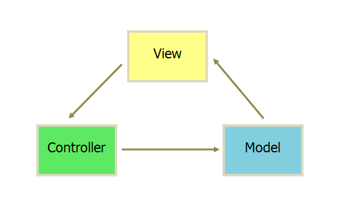
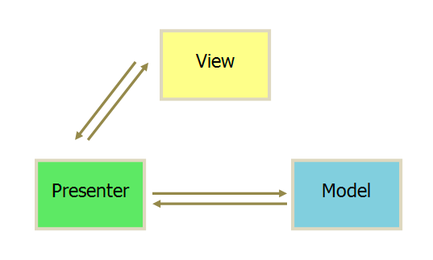
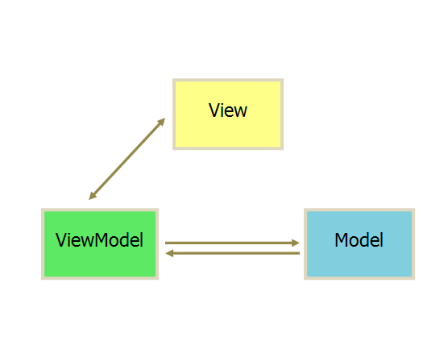

# 分层架构
一般是两层(B/S C/S) 或 三层(MVC/MVP)。  
四层五层比较少见，一般复杂的才会有。 因为分层太多，业务隔离不明显。分层也就没啥意思了  

## B/S C/S  
划分的对象是整个业务系统  
进程间

## MVC MVP
划分的对象是单个业务子系统，划分的维度是职责，将不同的职责划分到独立层  
进程内  

### MVC
思想： 将业务逻辑聚集到一个部件里面，在改进和个性化定制界面及用户交互的同时，不需要重新编写业务逻辑。

Model: 提供数据的  
View: 视图，显示视图的
Controller: 与用户交互的。负责从视图读取数据，控制用户输入，并向模型发送数据

  
- 所有通信都是单向的
- View传送指令到Controller(用户也可以直接将指令传到controller)
- Controller完成业务逻辑后要求model改变状态
- Model将新的数据发送到view，用户得到反馈。

### MVP
MVP模式将MVC中Controller改名为Presenter，同时改变了通信方向。MVC 进阶版  

- 各部分之间的通信都是双向的。 
- View与Model不发生联系，都通过Presenter传递 
- View非常薄，不部署任何业务逻辑，称为“被动视图”，即没有任何主动性，而Presenter非常厚，所有逻辑都 部署在这里。

### MVC 与 MVP 区别
MVP与MVC有着一个重大的区别：  
在MVP中View并不直接使用Model，它们之间的通信是通过Presenter(MVC中的Controller)来进行的，
所有的交互都发生在Presenter内部，而在MVC中View会直接从Model中读取数据而不是通过 Controller。  

这么做有何好处?  
> MVC 中 View 从 model 中读取数据，这样不可避免的 View 和 model 耦合。 所有有的虽然使用MVC但是他们不
> 用View直接使用model，而是和Controller联系

### MVVM
Model-View-ViewModel  
  
MVVM与MVC最大的区别就是:  
它实现了View和Model的自动同步，也就是当Model的属性改变时，我们不用再自己手动操作Dom元素，
来改变View的显示，而是改变属性后该属性对应View层显示会自动改变。  
> 通过这样的方式来解决耦合问题，其实还是耦合了，只不过不用手动改了

## 总结
分层架构设计最核心的一点就是需要**保证各层之间的差异足够清晰，边界足够明显**，让人看到架构图后就能看懂整个架构，这也是分层不能分太多层的原因。  

分层架构之所以能够较好地支撑系统扩展，本质在于**隔离关注点（separation of concerns）**，即每个层中的组件只会
处理本层的逻辑。比如说，展示层只需要处理展示逻辑，业务层中只需要处理业务逻辑，这样我们在扩展某层时，
其他层是不受影响的，通过这种方式可以支撑系统在某层上快速扩展

分层结构的另外一个特点就是**层层传递**，也就是说一旦分层确定，整个业务流程是按照层进行依次传递的，不能在层之间进行跳跃  
Controller -> Service -> Domain 不能跳跃，即使Service 啥也没干  
这种强制约束有啥好处？
> 依赖独立，两两依赖，某层只依赖于上层
