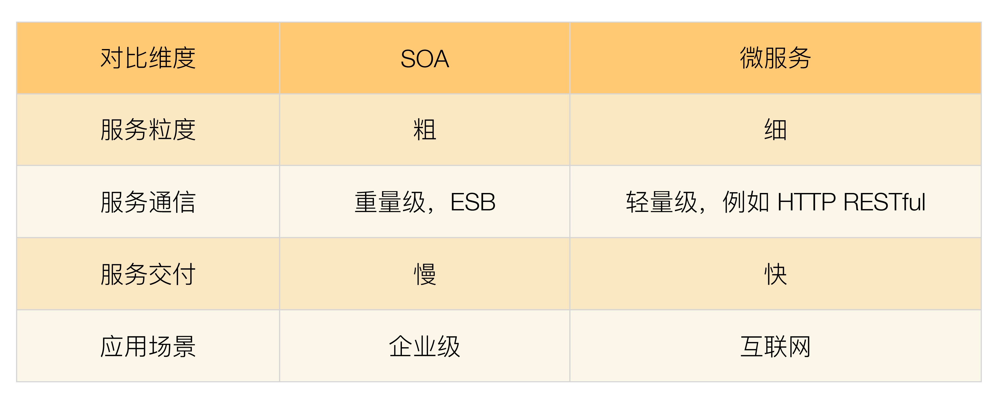

# 微服务
ThoughtWorks 的 James Lewis 针对微服务概念在 QCon San Francisco 2012 发表了演讲。

## 微服务与 SOA 的关系

关于 SOA 和微服务的关系和区别，大概分为下面几个典型的观点  

- 微服务是 SOA 的实现方式  
  > 微服务就是使用 HTTP RESTful 协议来实现 ESB 的 SOA”“使用 SOA 来构建单个系统就是微服务”和“微服务就是更细粒度的 SOA”  
  > 这个好理解, 虽然不准确，但是拿来理解SOA很容易
- 微服务是去掉 ESB 后的 SOA
- 微服务是一种和 SOA 相似但本质上不同的架构理念

### 区别
- 服务粒度
  > SOA 的服务粒度要粗一些，而微服务的服务粒度要细一些。例如，对一个大型企业来说，“员工管理系统”就是一个 SOA 架构中的服务；
  > 而如果采用微服务架构，则“员工管理系统”会被拆分为更多的服务
- 服务通信
- 服务交付
  > 微服务理念是快速交付，所以需要持续集成，自动化测试，自动化部署等配套的基础设施。  
  > SOA 无要求
- 应用场景
  > SOA 更加适合于庞大、复杂、异构的企业级系统，这也是 SOA 诞生的背景. 这类系统的典型特征就是很多系统已经发展多年，采用不同的企业级技术，有的是内部开发的，有的是外部购买的，无法完全推倒重来或者进行大规模的优化和重构。因为成本和影响太大，只能采用兼容的方式进行处理，而承担兼容任务的就是 ESB  
  > 微服务更加适合于快速、轻量级、基于 Web 的互联网系统

  
，SOA 和微服务本质上是两种不同的架构设计理念，只是在“服务”这个点上有交集而已，因此两者的关系应该是上面第三种观点。

## 微服务
small、lightweight、automated，基本上浓缩了微服务的精华，也是微服务与 SOA 的本质区别所在。  
### 微服务的陷阱
- 服务划分过细，服务间关系复杂
- 服务数量太多，团队效率急剧下降
- 调用链太长，性能下降
- 调用链太长，问题定位困难
- 没有自动化支撑，无法快速交付
- 没有服务治理，微服务数量多了后管理混乱
