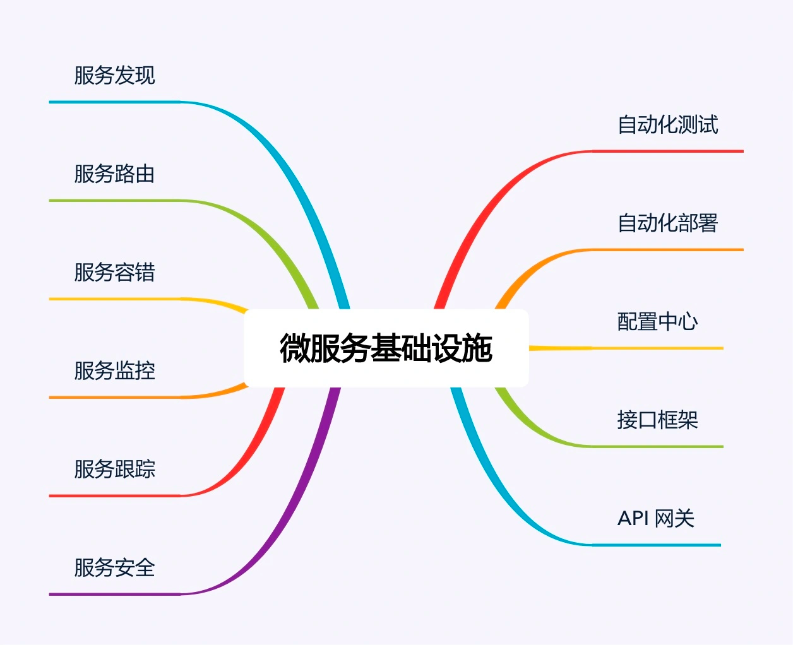

# 微服务
ThoughtWorks 的 James Lewis 针对微服务概念在 QCon San Francisco 2012 发表了演讲。

## 微服务与 SOA 的关系

关于 SOA 和微服务的关系和区别，大概分为下面几个典型的观点  

- 微服务是 SOA 的实现方式  
  > 微服务就是使用 HTTP RESTful 协议来实现 ESB 的 SOA”“使用 SOA 来构建单个系统就是微服务”和“微服务就是更细粒度的 SOA”  
  > 这个好理解, 虽然不准确，但是拿来理解SOA很容易
- 微服务是去掉 ESB 后的 SOA
- 微服务是一种和 SOA 相似但本质上不同的架构理念


### 区别
- 服务粒度
  > SOA 的服务粒度要粗一些，而微服务的服务粒度要细一些。例如，对一个大型企业来说，“员工管理系统”就是一个 SOA 架构中的服务；
  > 而如果采用微服务架构，则“员工管理系统”会被拆分为更多的服务
- 服务通信
- 服务交付
  > 微服务理念是快速交付，所以需要持续集成，自动化测试，自动化部署等配套的基础设施。  
  > SOA 无要求
- 应用场景
  > SOA 更加适合于庞大、复杂、异构的企业级系统，这也是 SOA 诞生的背景. 这类系统的典型特征就是很多系统已经发展多年，采用不同的企业级技术，有的是内部开发的，有的是外部购买的，无法完全推倒重来或者进行大规模的优化和重构。因为成本和影响太大，只能采用兼容的方式进行处理，而承担兼容任务的就是 ESB  
  > 微服务更加适合于快速、轻量级、基于 Web 的互联网系统

  
，SOA 和微服务本质上是两种不同的架构设计理念，只是在“服务”这个点上有交集而已，因此两者的关系应该是上面第三种观点。

## 微服务
small、lightweight、automated，基本上浓缩了微服务的精华，也是微服务与 SOA 的本质区别所在。  
### 微服务的陷阱
- 服务划分过细，服务间关系复杂
- 服务数量太多，团队效率急剧下降
- 调用链太长，性能下降
- 调用链太长，问题定位困难
- 没有自动化支撑，无法快速交付
- 没有服务治理，微服务数量多了后管理混乱


## 微服务最佳实践
微服务难的是如何拆分的问题，现有的方法有很多，比如DDD等  
### 服务粒度
服务粒度太大拆分不彻底，还是有耦合，太小增加系统复杂性等  
本书的拆分有一个观点是 "三个火枪手"， 根据**团队的开发能力**来拆分成几个微服务，而**不是以往的根据业务来拆分**  
三个火枪手意思是三个开发人员维护一个微服务，比如6个开发人员建议2个微服务, 然后随着业务的增长，人多了再
拆分更多的微服务  

为什么是三个而不是2个或4个？
> 从系统规模来讲，3 个人负责开发一个系统，系统的复杂度刚好达到每个人都能全面理解整个系统，又能够进行分工的粒度；  
> 2 个人开发一个系统，系统的复杂度不够，开发人员可能觉得无法体现自己的技术实力；  
> 4 个， 系统复杂度又会无法让开发人员对系统的细节都了解很深。  
> 3个，还可以备份，一个人请假也没事

### 拆分方法
现有的有DDD, 8X flow 等  

#### 基于业务拆分
这是最常见的一种拆分方式，将系统中的业务模块按照职责范围识别出来，每个单独的业务模块拆分为一个独立的服务。
#### 基于可扩展性拆分
将系统中已经成熟和改动不大的服务拆分为稳定服务，将经常变化和迭代的服务拆分为变动服务  
稳定的拆分粒度大一些，不经常变动的粒度小一些  
**好处：**  
提升项目快速迭代的效率，避免在开发的时候，不小心影响了已有的成熟功能导致线上问题。  

这个方法第一次听

#### 基于可靠性拆分
就是核心业务服务和非核心业务服务拆分的方式  

#### 基于性能
性能好的部分和性能差的部分  
将性能要求高或者性能压力大的模块拆分出来，避免性能压力大的服务影响其他服务  

**_以上几种拆分方式不是多选一，而是可以根据实际情况自由排列组合_**


### 基础设施
  
服务发现、服务路由、服务容错：这是最基本的微服务基础设施。

#### 自动化测试
这个很重要，容易忽略  
服务那么多，服务间接口那么多，如果不自动化测试，完全没法搞，微服务提倡的是快速交付，必须使用自动化测试这种效率高的  
如果因为团队规模和人力的原因无法全面覆盖，至少要做到接口测试自动化。  

#### 自动化部署

#### 配置中心
将服务公共配置放到一个地方，就是配置服务器，其他各个服务去这里拉配置，一旦有配置更新，不用每个机器都搞  

#### 接口框架
微服务提倡轻量级的通信方式，一般采用 HTTP/REST 或者 RPC 方式统一接口协议，但如果这样还不够，我们还有
规定数据格式的规范，比如说用json, 请求体如下:  

```json
{
  "requestId": 10086,
  "time": "2022-12-03 18:00:00",
  "caller": "tencent",
  "api": "getMoney",
  "param": {
    "userId": 29000
  }
}
```

不要干ESB的事，现在很多框架都是，约束用户行为，来简化，要不你传json 他传xml的，你json请求题随便写，他随便
写，这让系统处理起来分费劲

#### API 网关
服务内部之间可以互相调用，但是外部服务调用，需要搞一些动作，
主要包括接入鉴权（是否允许接入）、权限控制（可以访问哪些功能）、传输加密、请求路由、流量控制等功能。

#### 服务发现

#### 服务路由
有了服务发现后，微服务之间能够方便地获取相关配置信息，但具体进行某次调用请求时，
我们还需要***从所有符合条件的可用微服务节点中挑选出一个具体的节点***发起请求，这就是服务路由需要完成的功能。

服务路由和服务发现紧密相关，服务路由一般不会设计成一个独立运行的系统，通常情况下是和服务发现放在一起实现的。对于自理式服务发现，服务路由是微服务内部实现的；对于代理式服务发现，服务路由是由 LOAD BALANCER 系统实现的。无论放在哪里实现，服务路由核心的功能就是路由算法。常见的路由算法有：随机路由、轮询路由、最小压力路由、最小连接数路由等。  

SpringCloud 是 Ribbon 和 Feign好像

#### 服务容错
服务多了，如果有一个服务挂掉很容易影响其他服务，人工处理效率太低了，必须要自动化  
常见的服务容错包括请求重试、流控和服务隔离。通常情况下，服务容错会集成在服务发现和服务路由系统中。  

SpringCloud 中用 Hystrix

#### 服务监控
看看 newrelic 的威力  

