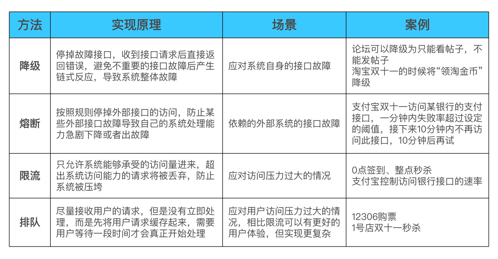

# 接口级故障

接口级故障是相对于系统级故障来说的  
系统级故障就是系统不可用，机器宕机等  
接口级故障表现是:  
系统并没有宕机、网络也没有中断，但业务却出现问题了，例如业务响应缓慢、
大量访问超时和大量访问出现异常（给用户弹出提示“无法连接数据库”）。这类问题的主要原因在于系统压力太大、负载太高，
导致无法快速处理业务请求，由此引发更多的后续问题。最常见的情况就是，数据库慢查询将数据库的服务器资源耗尽，
导致读写超时，业务读写数据库时要么无法连接数据库、要么超时，最终用户看到的现象就是访问很慢，一会儿访问抛出异常，
一会儿访问又是正常结果。

## 原因
- 内部原因: 程序bug, 导致内存或者cpu过高 
- 外部原因: 有人爬你，或者是秒杀等，瞬间并发连接数多的情况

## 解决
宗旨: 优先保证核心业务 和 优先保证绝大部分用户

### 服务降级
降级的核心思想就是丢车保帅，优先保证核心业务。  
比如，论坛可以降级为只能看帖子，不能发帖子等  

#### 系统后门降级
简单来说，就是系统预留了后门用于降级操作。  
例如，系统提供一个降级 URL，当访问这个 URL 时，就相当于执行降级指令，具体的降级指令通过 URL 的参数传入即可。
这种方案有一定的安全隐患，所以也会在 URL 中加入密码这类安全措施。  

**优缺点:**  
实现成本低  
但主要缺点是如果服务器数量多，需要一台一台去操作，效率比较低，这在故障处理争分夺秒的场景下是比较浪费时间的。(独立降级系统解决这问题)

#### 独立降级系统
为了解决系统后门降级方式的缺点，我们可以将降级操作独立到一个单独的系统中，实现复杂的权限管理、批量操作等功能。  
现在不管做什么，一般都搞个单独的模块来做公共的事情，谁还会一个机器一个机器的搞啊

### 熔断
熔断是指按照规则停掉外部接口的访问，防止某些外部接口故障导致自己的系统处理能力急剧下降或者出故障。  
  

熔断是应对依赖的**外部系统故障**问题  
降级是应对自身内部故障  

熔断规则一般是什么样的?  
> 阈值设计，例如 1 分钟内 30% 的请求响应时间超过 1 秒就熔断，这个策略中的“1 分钟”“30%”“1 秒”都对最终的熔断效果有影响。实践中，一般都是先根据分析确定阈值，然后上线观察效果，再进行调优。  

### 限流
#### 限流方法1： 基于请求线路
两种方式:  
- 限制总量; 比如直播间超过100万人就不再让进了
- 限制时间量，也就是限制一段时间内某个指标的上限; 例如 1 分钟内只允许 10000 个用户访问；每秒请求峰值最高为 10 万。
#### 限流方式2： 基于资源

#### 限流算法

有很多种，但我认为最好理解，最简单有效的就是 消息队列

## 1Image

