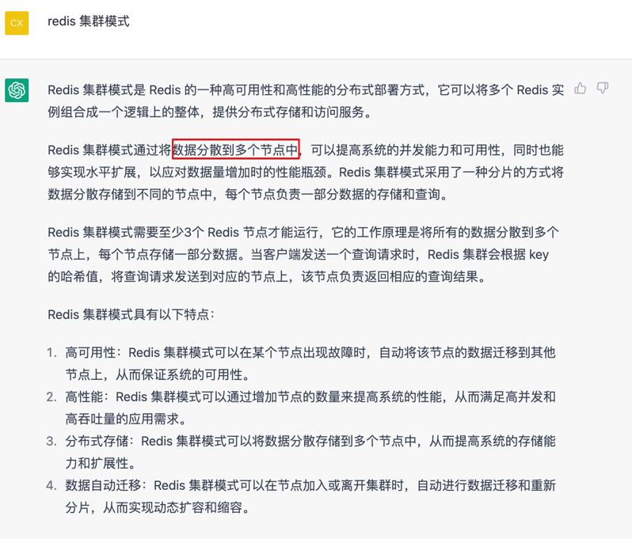

# FMEA 方法，排除架构可用性隐患的利器
FMEA(Failure Mode and effects analysis) 具体方法：  
- 给出初始的架构设计图
- 假设架构中某个部位发生故障
- 分析此故障对系统造成的影响
- 根据分析结果，判断架构是否需要进行优化

*其实就是列出来所有的case,然后分析*  

### 例子  
  
**说明**
- 功能点，是针对用户来说的，不是系统各模块来说的  
- 风险程度, 严重程度 ✖️ 故障概率， 比如地震啥的，虽然严重程度高，但是概率低，所以风险也不高  

