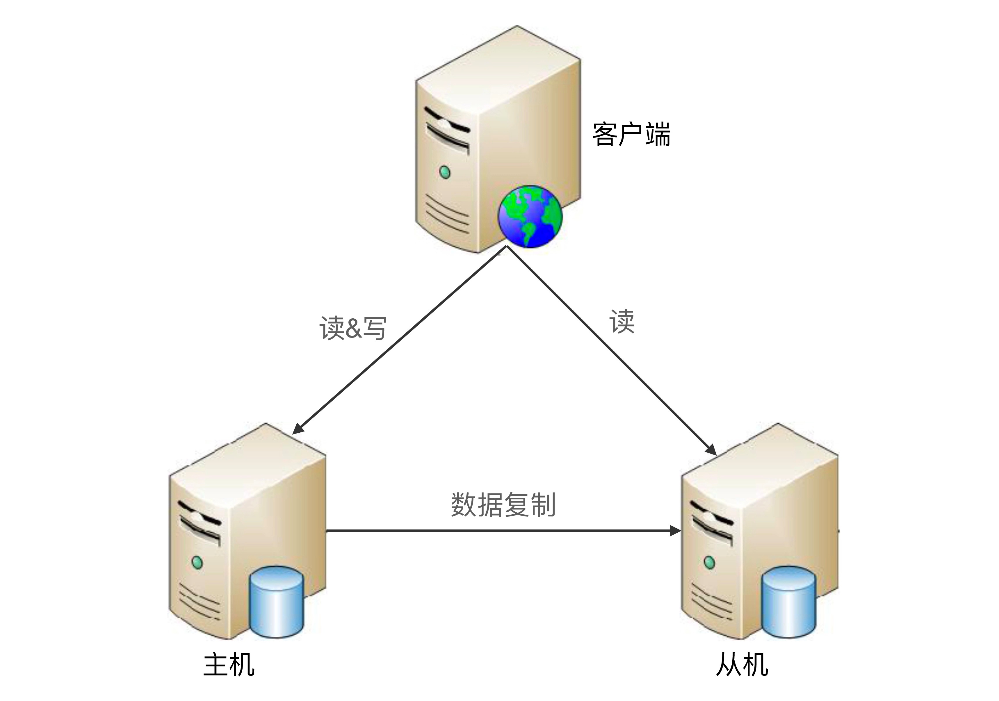

# 高可用存储架构
*看吧，所有的高性能和高可用，都是针对数据来的*  
存储高可用的本质：是通过将数据复制到多个设备，通过***冗余***的方式来实现高可用  
**复杂度在哪?**
>复杂度主要体现在如何应对复制延迟和中断导致的不一致问题。任何架构都这样，比如kafka redis 等

**考虑的点是？**
- 数据如何复制?
    >Mysql 和 redis 貌似都是开子线程来进行复制，父线程继续执行读写任务.
- 各节点职责?
- 复制延迟与复制中断问题?

## 双机架构
### 主备
注意和主从的区别，主从是为了高性能，这个是为了高可用  
最简单的存储高可用方案，几乎所有的存储系统都提供，比如 Redis Mysql MongoDb等  
#### 工作方式  
主负责读写，备来备份。当主挂的时候，备来当主  
#### 优缺点
**优点:**  
简单  
**缺点:**  
- 备平时不用，资源浪费啊.
- 出故障时，如何变主？一般是人工干预，但人工处理效率太低了，半夜故障找不到人  

#### 使用场景
学生管理系统，员工管理系统等。因为这系统数据一般更新频率低，即使出错也能再人工找回来  

### 主从
  
和主备的差别，就是从机负责了读业务，充分利用了资源。 高可用+高性能  

#### 优缺点
**优点:**  
- 主故障，读操作依然可用
- 相对于主备，充分利用资源

**缺点:**  
- 客户端感知主从关系了啊, 客户端需要把写给主，读负载均衡?或都给从。复杂度就上来了，业务侵入耦合严重
- 重要的是，如果数据复制延迟大，出现了数据不一致问题
- 故障时，还是需要人工干预

#### 使用场景
读多写少的。例如论坛，新闻网站啥的

### 双机切换

主从和主备都有俩问题:  
- 主机故障都不能写
- 主机故障需要认为手动的去指定新主机  

双机切换就是为了解决这俩个事情，但是复杂度可提升了不少  

和主从主备比，双机切换其实就是多了个**自动切换**功能.  
为了这个自动切换，需要考虑的事情  
- 状态判断
>状态传递的渠道: 是主从(备)互连，还是第三方仲裁。  其实就是怎么知道那个机器挂掉了  
>状态检测的内容: 是机器挂掉了无反应，还是反应慢等

- 切换决策
  >切换时机是什么？ 进程无反应了？还是还是主机响应时间超过 2 秒之类的  
  >切换策略是什么？ 主机恢复了之后，是当备还是再切回主
  >自动程度是什么？ 是全自动，还是需要用户点一些确认之类的

- 最难搞的，数据冲突如何解决
  >主备数据不一致问题。 一般情况下，从(备)机少点数据没啥，除非你的业务要求数据强一致性

#### 存在实现
- 互连式。就是主备机器互连来进行状态传递。 不建议
- 中介时。就是找个中介，主备把状态给中介，中介来统一维护状态。 有那么点zookeeper选举leader的意思了

### 主主复制
就是说，两个都是主机，都进行读写。这样就不用进行切换了，可真是个小天才，数据咋同步呢，冲突爆炸?      
不推荐啊。 这数据冲突咋搞啊

