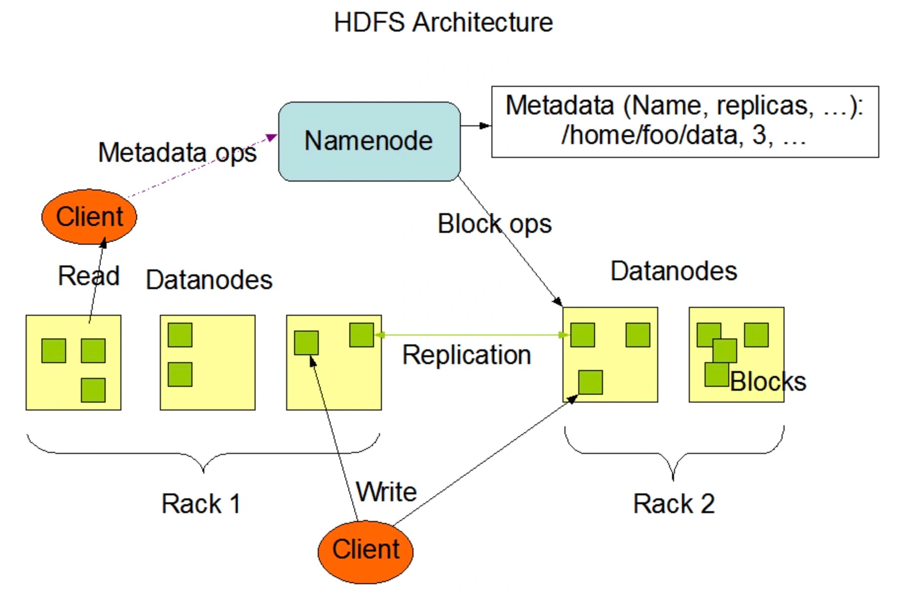
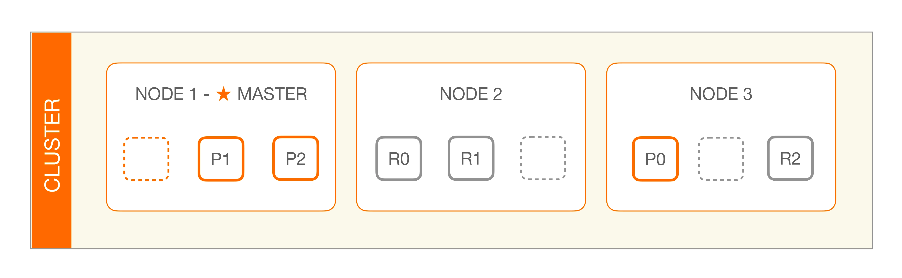
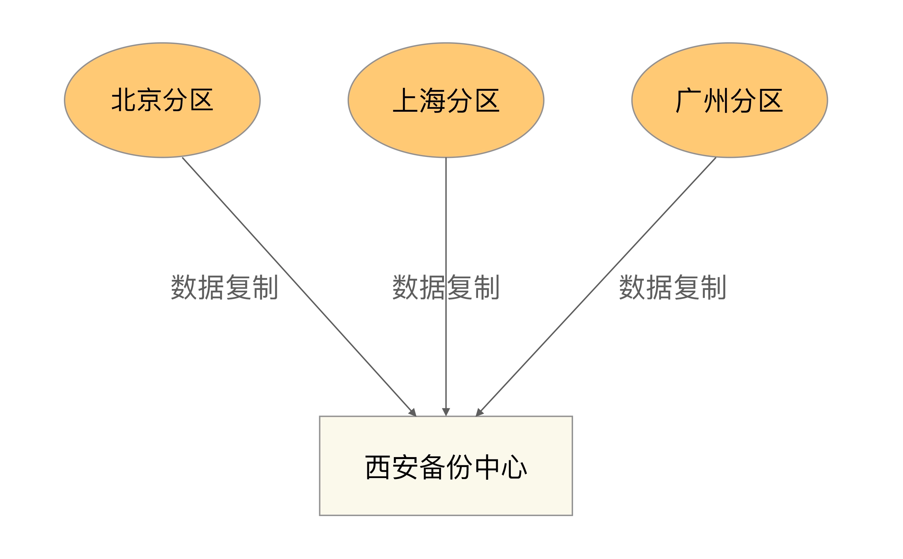
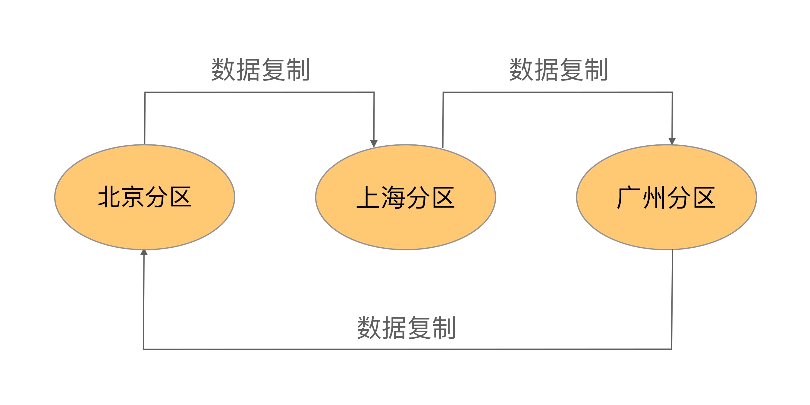
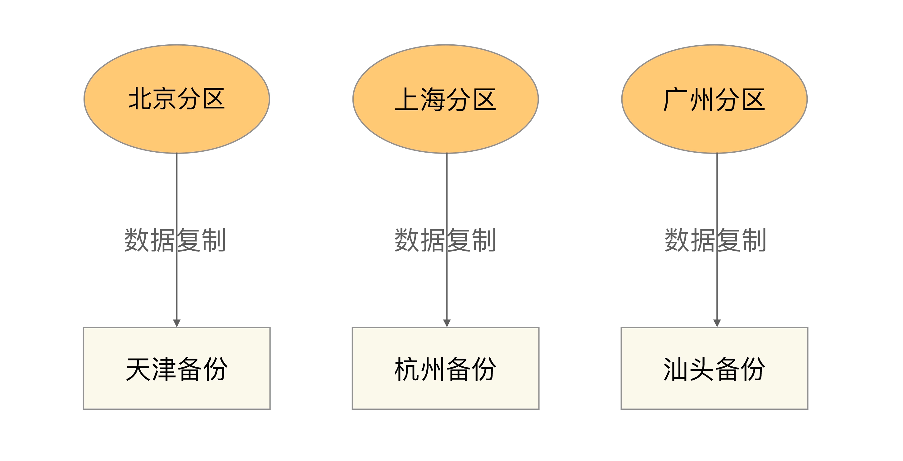

# 高可用存储架构
*看吧，所有的高性能和高可用，都是针对数据来主要讲的*  
存储架构主要讲数据，计算类的再说  
存储高可用的本质：是通过将数据复制到多个设备，通过***冗余***的方式来实现高可用  
**复杂度在哪?**
>复杂度主要体现在如何应对复制延迟和中断导致的不一致问题。任何架构都这样，比如kafka redis 等

**考虑的点是？**
- 数据如何复制?
    >Mysql 和 redis 貌似都是开子线程来进行复制，父线程继续执行读写任务.
- 各节点职责?
- 复制延迟与复制中断问题?

## 双机架构
### 主备
注意和主从的区别，主从是为了高性能，这个是为了高可用  
最简单的存储高可用方案，几乎所有的存储系统都提供，比如 Redis Mysql MongoDb等  
#### 工作方式  
主负责读写，备来备份。当主挂的时候，备来当主  
#### 优缺点
**优点:**  
简单  
**缺点:**  
- 备平时不用，资源浪费啊.
- 出故障时，如何变主？一般是人工干预，但人工处理效率太低了，半夜故障找不到人  

#### 使用场景
学生管理系统，员工管理系统等。因为这系统数据一般更新频率低，即使出错也能再人工找回来  

### 主从
  
和主备的差别，就是从机负责了读业务，充分利用了资源。 高可用+高性能  

#### 优缺点
**优点:**  
- 主故障，读操作依然可用
- 相对于主备，充分利用资源

**缺点:**  
- 客户端感知主从关系了啊, 客户端需要把写给主，读负载均衡?或都给从。复杂度就上来了，业务侵入耦合严重
- 重要的是，如果数据复制延迟大，出现了数据不一致问题
- 故障时，还是需要人工干预

#### 使用场景
读多写少的。例如论坛，新闻网站啥的

### 双机切换

主从和主备都有俩问题:  
- 主机故障都不能写
- 主机故障需要认为手动的去指定新主机  

双机切换就是为了解决这俩个事情，但是复杂度可提升了不少  

和主从主备比，双机切换其实就是多了个**自动切换**功能.  
为了这个自动切换，需要考虑的事情  
- 状态判断
>状态传递的渠道: 是主从(备)互连，还是第三方仲裁。  其实就是怎么知道那个机器挂掉了  
>状态检测的内容: 是机器挂掉了无反应，还是反应慢等

- 切换决策
  >切换时机是什么？ 进程无反应了？还是还是主机响应时间超过 2 秒之类的  
  >切换策略是什么？ 主机恢复了之后，是当备还是再切回主
  >自动程度是什么？ 是全自动，还是需要用户点一些确认之类的

- 最难搞的，数据冲突如何解决
  >主备数据不一致问题。 一般情况下，从(备)机少点数据没啥，除非你的业务要求数据强一致性

#### 存在实现
- 互连式。就是主备机器互连来进行状态传递。 不建议
- 中介时。就是找个中介，主备把状态给中介，中介来统一维护状态。 有那么点zookeeper选举leader的意思了

### 主主复制
就是说，两个都是主机，都进行读写。这样就不用进行切换了，可真是个小天才，数据咋同步呢，冲突爆炸?      
其实，这种主主的设计，类似与集群，要设计精妙，比如kafka集群, 每个节点上都可以写  
具体看 集群 部分

## 集群 和 分区
### 数据集群
数据集群又分**数据集中集群**和**数据分散集群**  
#### 数据集中集群
和主从等双机架构类似，只不过是，一主多从，一主多备等。  
**问题:**  
数据集中在主机上，主机有数据全集，这样，大量的数据，单台服务器可能无法存储  
**需要考虑的点:**  
- 主机如何将数据复制给备机?
  >一台备机，一个复制通道，多个备机，多个，主机压力优点大, 并且也容易出现多个备机数据不一致问题，都要考虑
- 备机如何检测主机状态?
  >互连，中介？ 推荐中介，比如用zookeeper
- 主机故障如何决定新主机?
  >zookeeper 用 ZAB 算法，这个算法很复杂

#### 数据分散集群
相比于数据集中集群，数据分散集群，是将数据分散到多个节点上，解决了单台机器存储上限的问题  
**特点:**  
每个实例会存储一部分数据，同时备份一部分数据(其他节点的)。  想象一下kafka集群的分区方式

**考虑的点:**  
- 均衡性
  >每个实例分大致相同大小的数据
- 容错性
  >其中一个实例挂掉了，算法需要将原来分配给故障服务器的数据分区分配给其他服务器
- 可伸缩
  >当集群容量不够，扩充新的服务器后，算法能够自动将部分数据分区迁移到新服务器，并保证扩容后所有服务器的均衡性。

还有个问题，谁来做上述的事情?
>可以搞一个单独的主机来分配这些东西。 也可以选一个节点来搞这些事情   
> Hadoop 的实现就是独立的服务器负责数据分区的分配，这台服务器叫作 Namenode
> 
> ES 的实现是选举一台服务器来做数据分区的分配，叫作 master node，其数据分区管理架构是：
> 

**场景:**  
- 数据集中集群
  >一般来说，数据集中集群适合数据量不大，集群机器数量不多的场景。
  > 例如，ZooKeeper 集群，一般推荐 5 台机器左右，数据量是单台服务器就能够支撑；
- 数据分散集群
 >而数据分散集群，由于其良好的可伸缩性，适合业务数据量巨大、集群机器数量庞大的业务场景。
 > 例如，Hadoop 集群、HBase 集群，大规模的集群可以达到上百台甚至上千台服务器。

### 数据分区
我们需要基于地理级别的故障来设计高可用架构，这就是数据分区架构产生的背景。害怕地震啥的，一个地区完了，其他地区还有  
数据分区指将数据按照一定的规则进行分区，不同分区分布在不同的地理位置上，每个分区存储一部分数据，
通过这种方式来规避地理级别的故障所造成的巨大影响。采用了数据分区的架构后，即使某个地区发生严重的自然灾害或者事故，受影响的也只是一部分数据，而不是全部数据都不可用；当故障恢复后，其他地区备份的数据也可以帮助故障地区快速恢复业务。

#### 分区规则
国家级，省级别，区级别等

#### 复制规则
- 集中式
    
  **优缺点:**
  > 设计简单，各区互相独立  
  > 扩展简单，比如新增一个武汉分区,你也去西安备份就完了  
  > 成本优点高，需要搞一个独立的备份中心  
- 互备式
    
  **优缺点:**
  > 设计复杂，各区又备份又存储的  
  > 扩展麻烦，比如新增一个武汉分区,哪个区给你备份呢，你备份谁呢。麻烦  
  > 成本点。没有独立备份中心  
- 独立式
    
  **优缺点:**
  > 设计简单，扩展简单。就是成本高，每个搞个备份中心，和集中式比，更壕

### 总结了
问题来了，数据集群和数据分区。 为何不搞一个跨地理位置的数据集群呢?  
> 远距离集群，网络延迟大，网络出问题几率大。 对于数据备份非常不友好  
> 所以好的方法是，**从业务上**对数据进行分区，当某一地方出现问题是，也只是这部分业务  

