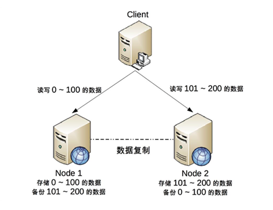
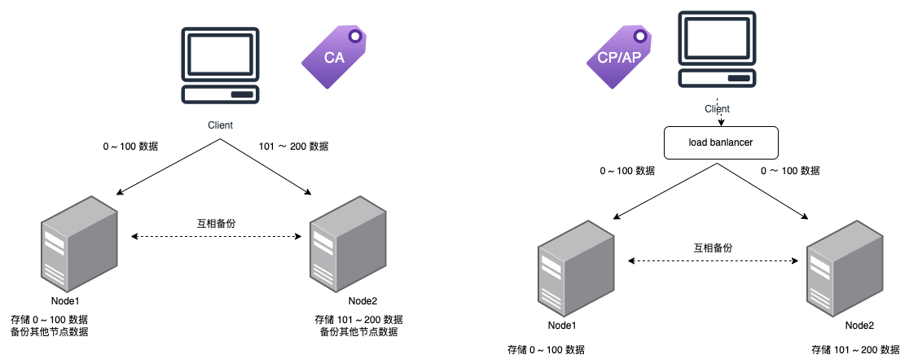

# CAP

## CAP 理论解释
第一版解释：  
对于一个分布式计算系统，不可能同时满足一致性（Consistence）、可用性（Availability）、分区容错性（Partition Tolerance）三个设计约束。  

第二版解释：  
在一个分布式系统（指**互相连接**并**共享数据**的节点的集合）中，当涉及读写操作时，只能保证一致性（Consistence）、可用性（Availability）、分区容错性（Partition Tolerance）三者中的两个，另外一个必须被牺牲。  

### 差异分析
**关键差异点**  
- 第二版定义了什么才是 CAP 理论探讨的分布式系统，强调了两点：interconnected 和 share data，
为何要强调这两点呢?  
因为分布式系统并不一定会互联和共享数据。最简单的例如 Memcache 的集群，相互之间就没有连接和共享数据，
因此 Memcache 集群这类分布式系统就**不符合 CAP 理论探讨的对象**；而 MySQL 集群就是互联和进行数据复制的，
因此是 CAP 理论探讨的对象。  

- 第二版强调了 write/read pair，这点其实是和上一个差异点一脉相承的。也就是说，CAP 关注的是
  对**数据**的**读写操作**，而**不是分布式系统的所有功能**。例如，ZooKeeper 的选举机制就不是 CAP 探讨的对象。

### 关于 P 的理解
CAP 理论告诉我们分布式系统只能选择 CP 或者 AP，但其实这里的前提是系统发生了“分区”现象。  

**是否分布式系统一定要有 P**  
否，如果没有分区现象，就要保证 CA  
网络连接无法做到 100% 可靠，所以节点间数据的分享也会出问题，所以这个 P 肯定是要考虑的。但如果我节点间数据
不需要共享，即请求只发给固定一个节点，岂不是不依赖网络，岂不是没有 P 的问题了。 例如kafka

**什么是 分区 现象**  
系统中，节点间的网络连接一切正常时，不存在分区现象  

如果系统没有发生分区现象，也就是说 P 不存在的时候（节点间的网络连接一切正常），我们没有必要放弃 C 或者 A，
应该 C 和 A 都可以保证，这就要求架构设计的时候既要考虑分区发生时选择 CP 还是 AP，
也要考虑分区没有发生时如何保证 CA。

## 为什么只能同时满足两个
虽然 CAP 理论定义是三个要素中只能取两个，但放到分布式环境下来思考，我们会发现必须选择 P（分区容忍）要素，
因为网络本身无法做到 100% 可靠，有可能出故障，所以分区是一个必然的现象。  
如果我们选择了 CA 而放弃了 P，
那么当发生分区现象时，为了保证 C，系统需要禁止写入，当有写入请求时，系统返回 error（例如，当前系统不允许写入），
这又和 A 冲突了，因为 A 要求返回 no error 和 no timeout。因此，分布式系统理论上不可能选择 CA 架构，
只能选择 CP 或者 AP 架构。

## CAP 关键点
### CAP 讨论的对象是*数据*，不是整个系统的所有功能  
CAP 理论的定义和解释中，用的都是 system、node 这类系统级的概念，这就给很多人造成了很大的误导，
认为我们在进行架构设计时，整个系统要么选择 CP，要么选择 AP。  
但在实际设计过程中，**每个系统不可能只处理一种数据**，而是包含多种类型的数据，有的数据必须选择 CP，
有的数据必须选择 AP。而如果我们做设计时，从整个系统的角度去选择 CP 还是 AP，就会发现顾此失彼，
无论怎么做都是有问题的。

### CAP 是忽略网络延迟的
这是一个非常隐含的假设，布鲁尔在定义一致性时，并没有将延迟考虑进去  
如果考虑网络延迟，CAP 理论中的 C 在实践中是不可能完美实现的，在数据复制的过程中，
节点 A 和节点 B 的数据并不一致。  

**如果业务上必须要求强一致性，如何做？**  
如果想理论上要求选择 CP 而实际上 CP 都做不到，只能选择 CA。  
- 单机
- 单点写入，其他节点做备份，无法做到分布式情况下多点写入。  
  CA 并非一定不能用分布式系统，只是不能做到多点写入，只要每个节点保存自己的数据，其他节点不能负载均衡而已。  
  
所以，Kafka 集群还真是 CA，读取数据只在一个节点，其他节点只是备份，永远没有一致性问题  

### 正常运行情况下，不存在 CP 和 AP 的选择，可以同时满足 CA  
不是分布式系统一定带 P 的，不要总考虑 CP AP， 当 P 不存在时候，也要会设计 CA

### 放弃并不等于什么都不做，需要为分区恢复后做准备

## 为何 Zookeeper 是 CP 而 Eureka 是 AP
Zookeeper 在 Leader 挂掉之后，整个 Zookeeper 就不可用，用于选举 leader, 这段时间服务注册不可用  
Eureka 不同，只要有一个 Eureka 还在, 那就还可以用，顶多数据不一致.  

## 一个分布式系统化，如何使用 CAP
一个分布式系统，需要考虑实现三点：
- 1.正常运行时的CA状态。
- 2.发生分区时转变为CP或AP状态。
- 3.分区解决时如何恢复为CA状态。

## Q&A
- 设计一个分布式系统要么是 CP 要么是 AP  ❌
> 1 也可能是CA  
> 2 CAP 不是对系统说的，是对数据的读写来说的，一个系统对于不同的数据情形，可能会有 AP 和 CP 

- 以下三个系统，各应该考虑满足什么?
  
第一个分布式，第二个集群部署

