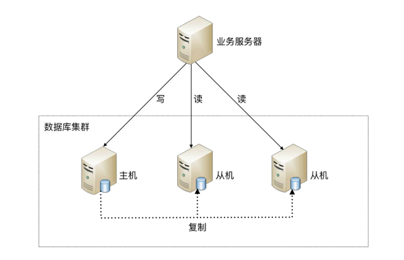
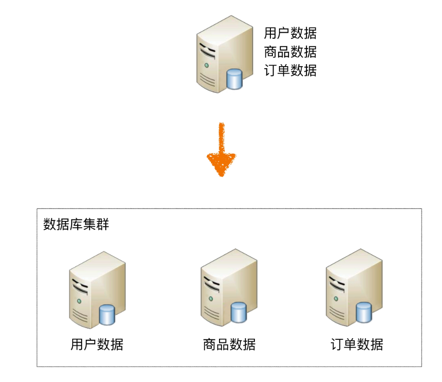
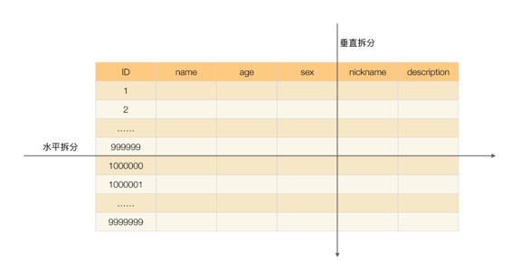

# 数据库设计
高性能数据库集群的第一种方式是“读写分离”，其本质是将访问压力分散到集群中的多个节点，但是没有分散存储压力；  
第二种方式是“分库分表”，既可以分散访问压力，又可以分散存储压力。
## 读写分离

  
读写分离的基本实现是：  
- 数据库服务器搭建主从集群，一主一从、一主多从都可以。  
- 数据库主机负责读写操作，从机只负责读操作。  
- 数据库主机通过复制将数据同步到从机，每台数据库服务器都存储了所有的业务数据。  
- 业务服务器将写操作发给数据库主机，将读操作发给数据库从机。

读写分离的实现逻辑并不复杂，但有两个细节点将引入设计复杂度：主从复制延迟和分配机制。

### 主从复制
mysql 上配置可以实现主从复制  

**如何解决主从复制延迟问题?**  
除非你的系统需要数据强一致性，否则不用在意  
**解决方法：**  
- Mysql 5.6 以后提供Semi-sync功能，即主机在写入时，确保从机都已复制完成再返回复制成功(和kafka配置同步2类似)。
不过一般大家不用，因为性能太差，除非你不在乎性能。  
- 还有一种说法是，不要试图在数据库层解决并发问题，因为很难解决，具体做法是用缓存，比如redis来解决读慢的问题，不要用主从 ✅
- 关键业务读主机，无关紧要业务读从机.  这种业务侵入较大

### 分配机制
也就是如何分配机器读写  
将读写操作区分开来，然后访问不同的数据库服务器，一般有两种方式：**程序代码封装和中间件封装。**  
程序封装简单，但是可迁移性，可重复使用性较差  
中间件开发叫复杂，可迁移性高，可重复使用  

**如何选择?**  
一般的业务量，或者小公司就用程序封装吧，一是因为开发中间件需要大量的人力和复杂度，二是你业务量也没必要  

## 分库分表
读写分离分散了数据库读写操作的压力，但没有分散存储压力，当数据量达到千万甚至上亿条的时候，单台数据库服务器的存储能力会成为系统的瓶颈  

### 业务分库
业务分库指的是按照业务模块将数据分散到不同的数据库服务器。  
  

带来的问题：  
- join 操作
- 事务
- 成本  服务器变多了

所以基于以上带来的问题，一般小公司或者业务量不到的，别考虑分库的事，太复杂，牢记架构设计三原则：
简单、合适、演进

### 分表
单个表数据量太大了，每次查个数据慢的要死  

#### 垂直分表
**如何拆？**  
- 将表中某些不常用且占了大量空间的列拆分出；  这样用户查询时就会快很多，数据库一次IO读的数据多  
- 根据业务或者三大范式，讲无关的列分出去；

带来的问题： 本来一次查询的事，现在要两次查询

#### 水平分表
水平分表适合表行数特别大的表，有的公司要求单表行数超过 5000 万就必须进行分表，这个数字可以作为参考，但并不是绝对标准。  

水平分表相比垂直分表，会引入更多的复杂性：  
**1. 路由**  
某条数据具体属于哪个切分后的子表，需要增加路由算法进行计算，这个算法会引入一定的复杂性。  
*范围路由*   
1 ~ 999999 放到数据库 1 的表中，1000000 ~ 1999999 放到数据库 2 的表中，以此类推。  
一般建议分段大小在 100 万至 2000 万之间，具体需要根据业务选取合适的分段大小。  
优点: 简单；数据扩展方便  
缺点：分布不均匀；有的1000万，有的500万（最后一个表）  
**2. Hash路由**  
根据用户id路由  
Hash 路由的优缺点和范围路由基本相反，Hash 路由的优点是表分布比较均匀，缺点是扩充新的表很麻烦，所有数据都要重分布。  
**3. 配置路由表** ❌  
存一个路由表来映射     

带来的问题：join， count 等会麻烦

