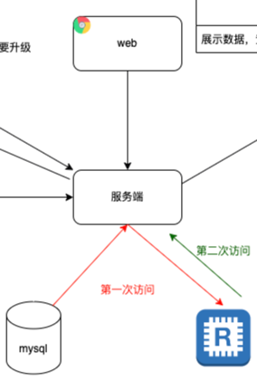

# 高性能缓存架构

一般用 Nosql 来做缓存 

## 什么情况下需要使用缓存

- 需要经过复杂运算后得出的数据，存储系统无能为力  
比如我设计过的项目中的 [资产管理系统](https://github.com/xichuang-chen/my-project#%E8%B5%84%E4%BA%A7%E7%AE%A1%E7%90%86%E7%B3%BB%E7%BB%9F) 的redis服务，根据工号来查询名下资产，如果没有缓存，每次用户请求数据都查一大堆
数据库，对数据库压力太大
- 读多写少的数据，存储系统有心无力。之前说过的，解决数据库读慢的问题，分库分表，主从配置都没来个缓存服务器简单有效

## 几种缓存需考虑场景

### 缓存穿透
缓存穿透是指缓存没有发挥作用，业务系统虽然去缓存查询数据，但缓存中没有数据，业务系统需要再次去存储系统查询数据。  

原因:    
- 可能有人恶意爬去数据，用一些不可能命中缓存的key，从而使每次都穿透缓存查询数据库

解决:  
- 布隆滤波器; 由所有Key组成过滤器，在这些过滤器中的请求才可以，非这些key的一律认为非法请求，直接返回  
- 对空的结果进行缓存；  缺点：耗内存

### 缓存击穿
和缓存穿透很像，不过缓存击穿一般是指应该在缓存中存在的数据，缓存中突然没了，是合法的请求  

原因:  
- 缓存的数据(一般是热点数据)突然过期了，瞬间来了好多请求，在还没来及缓存时，直接到数据库了  

解决:  
- 热点数据设置永不过期
- 设置一个互斥的锁，只让一个请求通过，只有一个请求去数据库拉取数据，取完数据，不管如何都需要释放锁，异常的时候也需要释放锁，要不其他线程会一直拿不到锁。

### 缓存雪崩
缓存雪崩是指缓存中有大量的数据，在同一个时间点，或者较短的时间段内，全部过期了，这个时候请求过来，缓存没有数据，都会请求数据库，则数据库的压力就会突增，扛不住就会宕机。  

原因:  
- 大部分key过期时间设置成一样了，同时过期会

解决:  
- 过期时间用随机，分散过期时间

### 缓存预热
将热点数据提前放入缓存，免得瞬间来了好多请求，缓存不及时，导致缓存击穿  

### 缓存热点
虽然缓存系统本身的性能比较高，但对于一些特别热点的数据，如果大部分甚至所有的业务请求都命中同一份缓存数据，
则这份数据所在的缓存服务器的压力也很大  

解决:  
缓存热点的解决方案就是复制多份缓存副本，将请求分散到多个缓存服务器上，减轻缓存热点导致的单台缓存服务器压力。

## 缓存策略