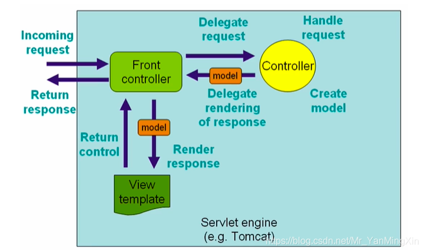
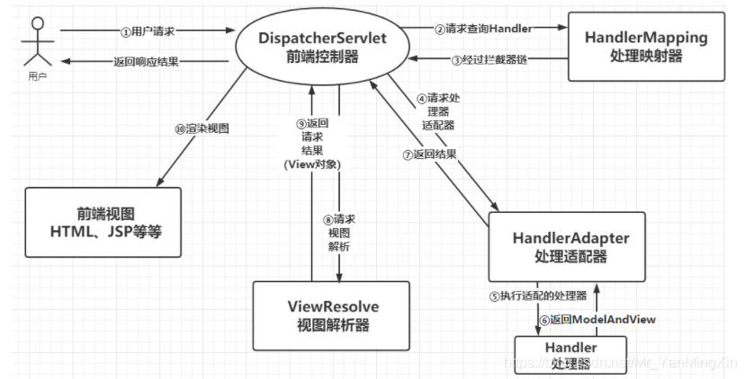

## Spring MVC 与 Spring Boot 关系
- Spring MVC 是一个基于 java 的 web 框架，用与构建 web 应用程序  
- 它提供了一个MVC（Model-View-Controller）模式的实现，用于分离业务逻辑、数据和用户界面。 
- Spring MVC需要手动配置和管理，包括配置文件、依赖项、Servlet容器等。 
- 它提供了许多灵活的配置选项和扩展点，允许开发人员根据特定需求进行自定义。

Spring boot，基于Spring Framework的快速开发和简化配置的框架。 
它旨在简化Spring应用程序的初始化和配置过程，提供了很多开箱即用的功能  
而 spring mvc 还要写servlet的，spring boot 已经内置了servlet容器(tomcat jetty)，不需要管  
spring mvc 是搞web的，还要写html的，想想p4ep  

## Spring MVC
官网  
  
网络  
  

