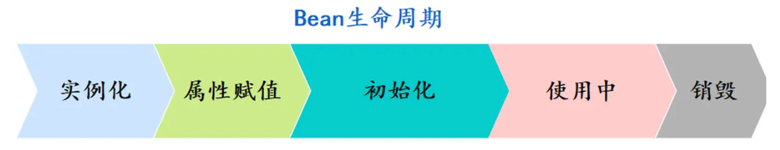
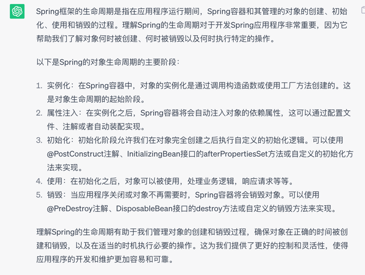
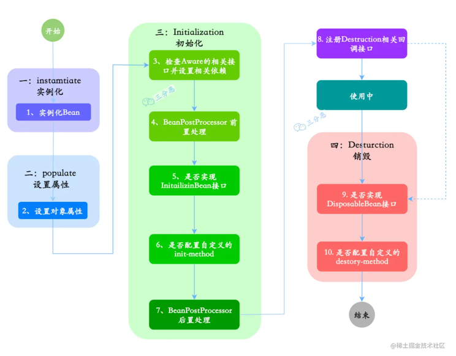
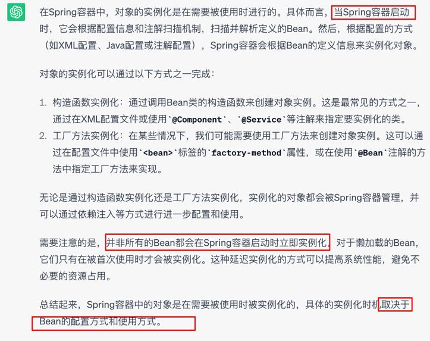
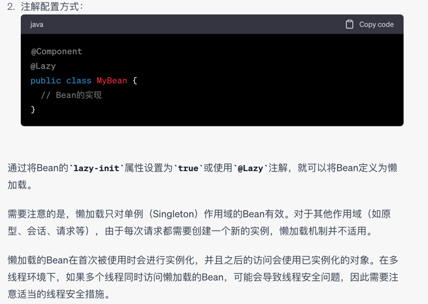
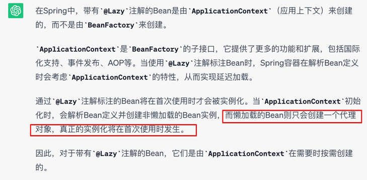
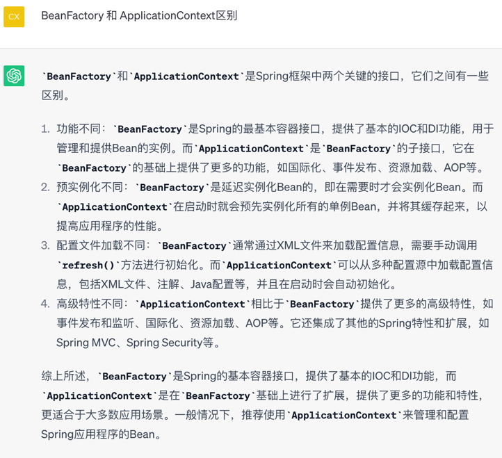
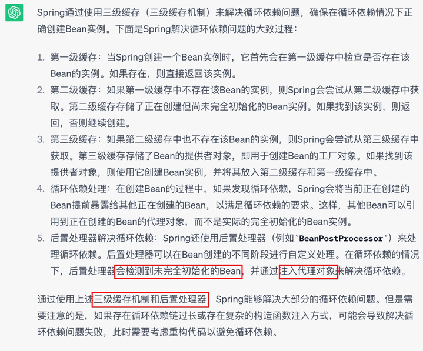
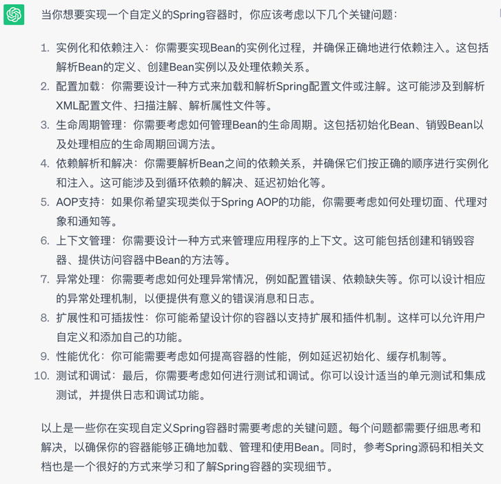

# Spring 生命周期
  
  
  
## 实例化

### spring bean 是在何时被实例化的
  

### 什么是懒加载的bean
懒加载的Bean在Spring容器启动时不会立即被实例化，而是在首次被使用时才会被实例化。这种延迟加载的机制可以提高系统的性能和资源利用率，因为只有在需要时才会进行实例化，避免了不必要的开销。  
  

### spring @lazy标注的bean是由 BeanFactory 创建的还是 ApplicationContext 来创建的
我们知道bean由两个工厂创建， BeanFactory 和 ApplicationContext  
BeanFactory 创建简单的bean, 并且延迟加载  
ApplicationContext 是 BeanFactory的基（非直接）  
所以是否 @lazy 标注的就是 BeanFactory创建的？  
> 否。  
  

再问，那什么是由 BeanFactory 创建的？  
>首先纠正，BeanFactory是一个创建bean的超级接口，所以可以说所有bean都是由他创建的  

再问，那 BeanFactory 和 ApplicationContext 到底有什么不同？
> 我感觉，BeanFactory是基础的，ApplicationContext 功能更多，二者不适合比  

## 属性注入
在实例化之后，Spring容器将会自动注入对象的依赖属性，这可以通过配置文件、注解或者自动装配实现。  

# 如何解决循环依赖  
A 依赖 B, B 依赖 A， A 创建需要 B 先好，但B 也需要 A 先好  
  

# 如果要你实现 Spring 容器，要考虑哪些问题？
从 IOC 和 AOP 两方面出发  
对于 IOC， 就是 bean 的管理方面出发  
从 bean 的生命周期来考虑， 实例化，属性注入，初始化，使用，销毁  
针对实例化，有考虑创建bean时循环依赖的问题， 创建bean的一些问题
属性注入的问题  
配置的读取等等问题  

