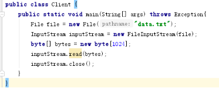
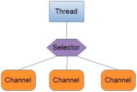
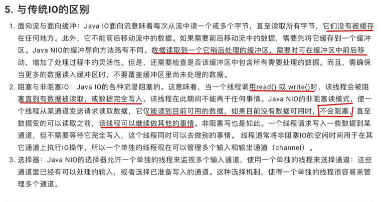

Java Nio
直接看这个链接  
https://developer.aliyun.com/article/785432  

在NIO中有几个比较关键的概念：Channel（通道），Buffer（缓冲区），Selector（选择器）。下例是传统的IO中读取一个文件内容的方式：  
  
- 这里的InputStream实际上就是为读取文件提供一个通道。因此可以将NIO 中的Channel同传统IO中的Stream来类比，但在传统IO中，_Stream是单向的_，比如InputStream只能进行读取操作，OutputStream只能进行写操作。而*Channel是双向的*，既可用来进行读操作，又可用来进行写操作。
- Buffer（缓冲区）是NIO中非常重要的一个概念，在NIO中所有数据的读和写都离不开Buffer。比如上面的一段代码中，*读取的数据是放在byte数组*当中，而在NIO中，读取的数据只能*放在Buffer中*。同样地，写入数据也是先写入到Buffer中。
- NIO中最核心的一个东西是Selector，Selector的作用就是用来轮询每个注册的Channel，一旦发现Channel有注册的事件发生，便获取事件然后进行处理。
  
用单线程处理一个Selector，然后通过Selector.select()方法来获取到达事件，在获取了到达事件之后，就可以逐个地对这些事件进行响应处理。
  
