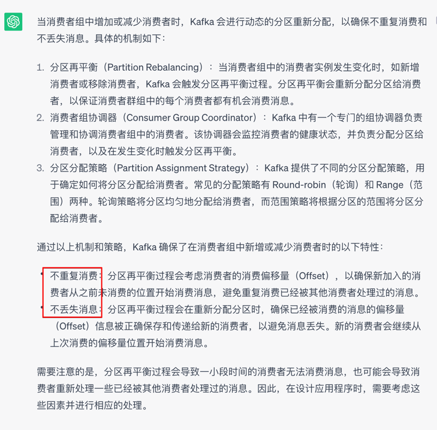
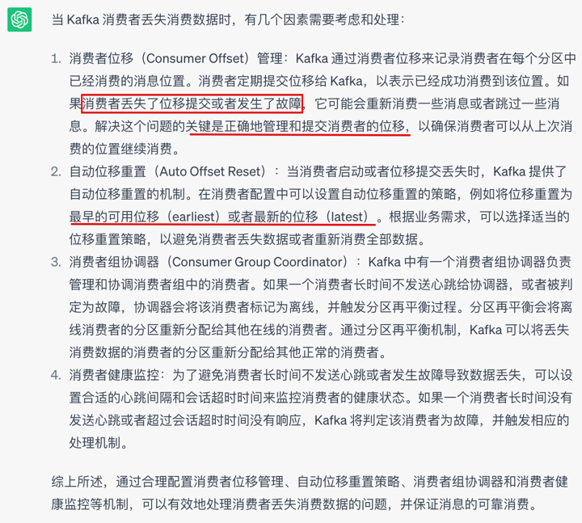
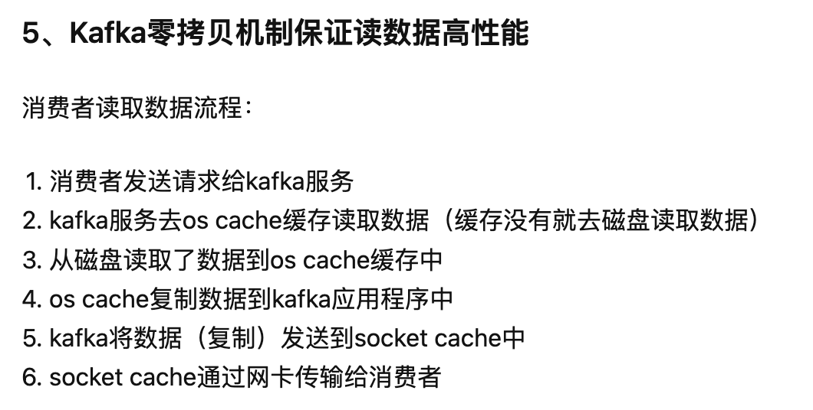

# Kafka

## 当消费者组中增加或减少消费者时，kafka 是如何保证不重复消费和丢失消息的
分区再平衡策略，根据消费位点来分区再平衡  
  

## 使用 kafka 时如何保证不丢失或重复消费
不丢失，就是用之前提交成功过的消费位点，会导致部分重复消费，不过无所谓，重复消费比丢数据强    
  
还有就是，丢数据意思是生产者没把数据发送成功，这就改 ACK 机制了  

重复消费  
- 客户端处理吧， 加入重复消费校验机制，如果你在意重复消费的话

## 消费者组
消费组 消费数据的时候，都必须指定一个group id，指定一个组的id假定程序A和程序B指定的group id号一样，那么两个程序就属于同一个消费组  
有一个主题topicA程序A去消费了这个topicA，那么程序B就不能再去消费topicA（程序A和程序B属于一个消费组） 再比如程序A已经消费了topicA里面的数据，
现在还是重新再次消费topicA的数据，是不可以的，但是重新指定一个group id号以后，可以消费。不同消费组之间没有影响。消费组需自定义，消费者名称程序自动生成（独一无二）

## 遇到过的问题
有这么一个场景，生产者会发送过来四种日志类型，但是消费方期望每种日志类型的日志是时间有序的  
刚开始：  
一种日志，往多个分区随机写，消费端不要求日志的顺序  
新需求：多了几种日志类型  
多了几种日志类型，多中日志随机写，消费端同时消费多种日志  
新需求：消费端要每种日志按照时间顺序来  
多个topic，❌  
生产数据时，根据日志类型选择分区，减轻了客户端识别日志类型，也减轻了客户端根据时间排序（牺牲了高性能）   

## 读写
生产者来数据，写入本地 -----> 磁盘顺序写保证写数据性能。就是追加数据。生产者生产消息，经过kafka服务先写到os cache 内存中，然后经过sync顺序写到磁盘上  
消费数据   -------> 零拷贝技术  

