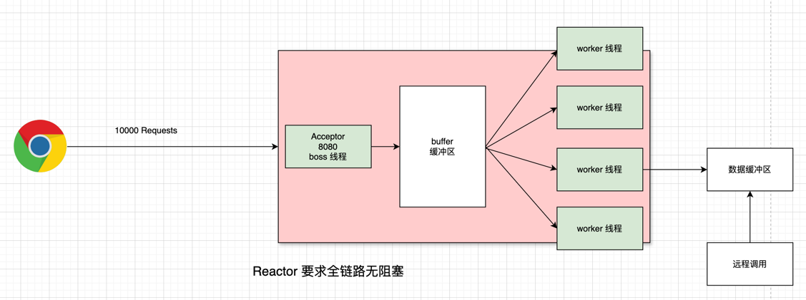

# 一些概念
## Stream API  
Java8提供的用于操作集合的强大工具，结合lambda函数式编程方式来简化代码的

### Reactive-Stream
Java9 提供的响应式流规范，定义了基于异步，消息驱动的全事件回调系统，保证 jvm 底层支持响应式流，之后才有响应式编程的整个上层设施生态  
- Publisher
- Subscriber
- Subscription
- Processor

#### 其他知识
响应式编程最早由微软 .NET 开发了Reactive库支持响应式编程  
后来Netflix开发了RxJava(Android等用)，也使用了  
Java9制定了响应式流的**标准和规范**[Reactive Stream](https://www.reactive-streams.org/), 在 `java.util.concurrent.Flow` 包下支持

# 普通的Jetty vs Netty
## 背压
Reactive Stream支持背压, 举例说明  
当同时有10000个请求到达时，Tomcat可能会不堪重负  
此时第一反应，就是要消峰，所以我们可能会想，Tomcat 有个缓存或者队列这些请求，然后服务器根据自己
消费能力来从队列里拿，就会应对这些请求了  
以上就是背压，缓存生产者数据，消费者根据能力消费

## 线程越多越好 or 越少越好
思考一下，为何要开线程？目的是什么？  
- 想要每个 CPU 都不闲着
- 避免线程频繁切换，因为线程频繁切换消耗cpu，以及要保存上下文之类的  
所以，如果cpu一直在忙，就不要开线程，避免线程之间竞争带来的资源耗费，cpu密集型  
如果线程执行了大量IO操作，这时候如果不开线程就会使这个CPU闲着，所以要开线程

## Netty 请求示例
  
- boss线程负责接收请求，然后放入缓冲区
- worker线程一般和cpu核心数一样
- worker线程负责处理具体的请求
- 当某一worker线程处理的请求执行IO操作时，worker线程不会闲着，继续从缓冲区拿新请求，当上一个请求数据请求结束后会放入worker自己的缓冲区，然后worker线程去拿，整个过程worker线程不闲着
  >不保证上述是否正确
  - 如何保证worker不闲着，如何异步处理的？
  > Netty 使用事件驱动的架构，Worker 线程会监听事件（如连接建立、数据到达等），并在事件发生时被唤醒处理。这种方式避免了线程闲置，能够快速响应多个请求  
  > 实现了java nio，也就是selector 等来处理多个 io 操作等
- 要求**全链路无阻塞**，比如你使用了RestClient而不是WebClient，就会阻塞当前worker

## 为何使用 Webflux
借用官网的  
- 处理高并发，异步
- 函数式编程

### Webflux
supports Reactive Streams back pressure, and runs on such servers as Netty, Undertow, and Servlet containers.  
Webflux 选择 [Reactor](https://github.com/reactor/reactor) 来支持 Reactive API, Reactor 这个库实现了Reactive Stream API规范，它使用Mono Flux等

