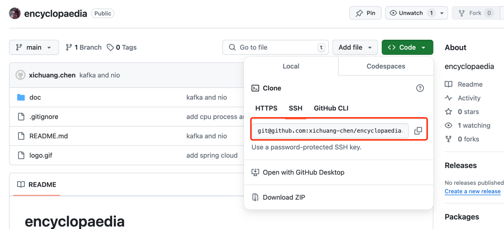

# 本机如何配置 github 双账户
以macos为例
## 1. 生成 SSH 密钥
```bash
ssh-keygen -t rsa -b 4096 -C "your_email@example.com"
``` 
当系统提示你输入文件名时，你可以为每个账户使用不同的文件名，例如：

`~/.ssh/id_rsa_github_personal`  
`~/.ssh/id_rsa_github`

之后，会在 `~/.ssh` 目录生成四个文件，对应各自的公钥和私钥
```
id_rsa_github_personal
id_rsa_github_personal.pub
id_rsa_github
id_rsa_github.pub
```

## 2. 添加 SSH 密钥到 SSH 代理(Optional)
如果上一步设置了密码，可以配置该步骤，目的是不用每次都输入密码  
具体我没用，是否是这样没验证  

```bash
eval "$(ssh-agent -s)"
ssh-add ~/.ssh/id_rsa_github_personal
ssh-add ~/.ssh/id_rsa_github
```

## 3. 将 SSH 公钥添加到对应的 GitHub 账户中

## 4. 编辑或创建 ~/.ssh/config 文件
添加以下内容
```plaintext
# Personal GitHub account
Host github.com-personal
    HostName github.com
    User git
    IdentityFile ~/.ssh/id_rsa_github_personal

# Common GitHub account
Host github.com
    HostName github.com
    User git
    IdentityFile ~/.ssh/id_rsa_github
```
## 5. 使用
在克隆/push仓库时，使用**_配置的 Host 名称_**：  
注意，git 如何判断使用哪个账户去操作远程仓库，是根据 host 的，在第4步，我们配置了不同的Host就是为了区分如何
使用不同的账户的  
- 个人账户
```bash
git clone git@github.com-personal:username/repo.git
```
- 常用账户
```bash
git clone git@github.com:username/repo.git
```

**疑问1:**  
我的个人repo，在 github 中是 `git@github.com:username/repo.git`, 没有`-personal`后缀，
这里加这个后缀能找到对应的repo吗？
  

**A:**  
一定要清楚一点，`git@github.com-personal` 这是 SSH 协议的路径，指定了一个名为 github.com-personal 的主机。
这个主机名在你的 SSH 配置文件 (~/.ssh/config) 中定义，用于区分不同的 GitHub 账户。  
也就是说，`git@github.com-personal`是给本地 ssh 用的，他拿到这个，然后就知道了对应的 ssh 密钥，也就是 `id_rsa_github_personal`,
所以说，github上那个是默认的，如果你在ssh config定义了hostname, 就要用你定义的，你找到了对应的github账户，
只需要repo name 就可以了。  

## 6. 配置 Git 用户信息
进入个人项目目录
```shell
cd ~/path/to/personal/repo
git config user.name "Your Personal Name"
git config user.email "your_personal_email@example.com"
```
如果你的个人github只是偶尔使用，就这么配，在你的个人repo中设置username 和 email。保证和经常用的那个不同  

对于常用的github账户，设置global user.nam 和 user.email就好， 这样不用每个repo都设一遍


## Other
个人仓库想推代码，可以这么做  
- 设置个人仓库的user.name 和 user.email
```shell
cd ~/mycode/encyclopedia
git config user.name
git config user.email  // 查看设置是否正确
// 如果不正确
git config user.name xichuang.chen
git config user.email 410****@qq.com
```
- 确保自己repo remote设置正确
```shell
cd ~/mycode/encyclopedia
//查看 remote
git remote -v
// 如果是
origin	git@github.com:xichuang-chen/encyclopaedia.git (fetch)
origin	git@github.com:xichuang-chen/encyclopaedia.git (push)
// 删除该 remote, 因为我们配置不同的host, 现在用这个只会匹配到 hostname配置是github.com的那个
git remote rm origin
// 重新 add remote
git remote add origin git@github.com-personal:xichuang-chen/encyclopaedia.git
```

- 确保非个人repo, user.name 和 user.email 没问题
```shell
git config --global user.name
git config --global user.email
```
在非个人 repo, 再查一下 name, email 保证没被覆盖，用的是global的  
remote 是默认的， 别加 -personal 了

